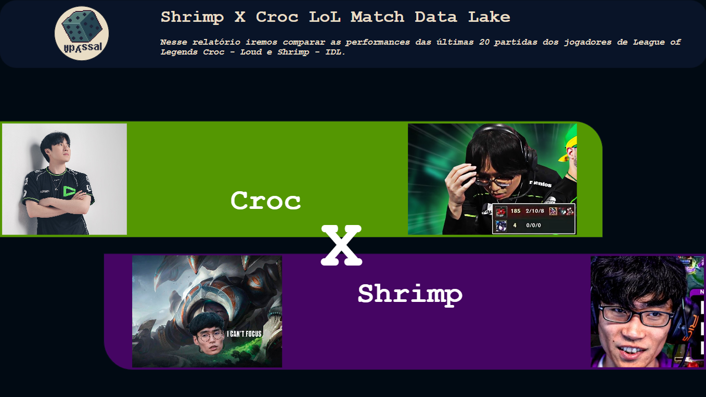

<h1 align="center"> Shrimp X Croc - Match Data Lake </h1>

Data Lake de comparação entre os jogadores de LoL Croc - Loud e Shrimp - IDL.

  <a href="#-tecnologias">Tecnologias</a>&nbsp;&nbsp;&nbsp;|&nbsp;&nbsp;&nbsp;
  <a href="#-projeto">Projeto</a>&nbsp;&nbsp;&nbsp;|&nbsp;&nbsp;&nbsp;
  <a href="#-código">Código</a>&nbsp;&nbsp;&nbsp;|&nbsp;&nbsp;&nbsp;
  <a href="#-relatório">Relatório</a>&nbsp;&nbsp;&nbsp;|&nbsp;&nbsp;&nbsp;
  <a href="#memo-licença">Licença</a>

  

 

  

## 🚀 Tecnologias

Esse projeto foi desenvolvido com as seguintes tecnologias:

- Google Colab
- API DataDragon
- PySpark
- PowerBI
- Git e Github

## 💻 Projeto

O Shrimp X Croc - Match Data Lake foi desenvolvido como um trabalho da disciplina de BigData do terceiro período do curso de Análise e Desenvolvimento de Sistemas da Faculdade Senac Pernambuco.

## 🚧 Código

O código em PySpark (disponível no arquivo .ipynb ) foi construído pensando no contexto de dados que precisam ser atualizados a todo momento, mesmo que nesse momento tenha sido feito um recorte de um momento específico. Então pode ficar a vontade para utilizar o código!
*Lembre-se de atualizar os dados da "api-key" para os que obtiver através do [site da Riot](https://developer.riotgames.com/) para utilizar a API DataDragon.*

## 📚 Relatório

Na pasta Relatório você pode encontrar o pdf e o arquivo .pbix (PowerBI) com o relatório visual feito a partir dos dados dos jogadores. Lembre-se de filtrar os dados pelo PowerBI (de vitórias e derrotas por exemplo) para encontrar ainda mais reflexões. :wink:

## :memo: Licença

Esse projeto está sob a licença MIT.

---

Feito com ♥ by Abyssal Roll :wave:
